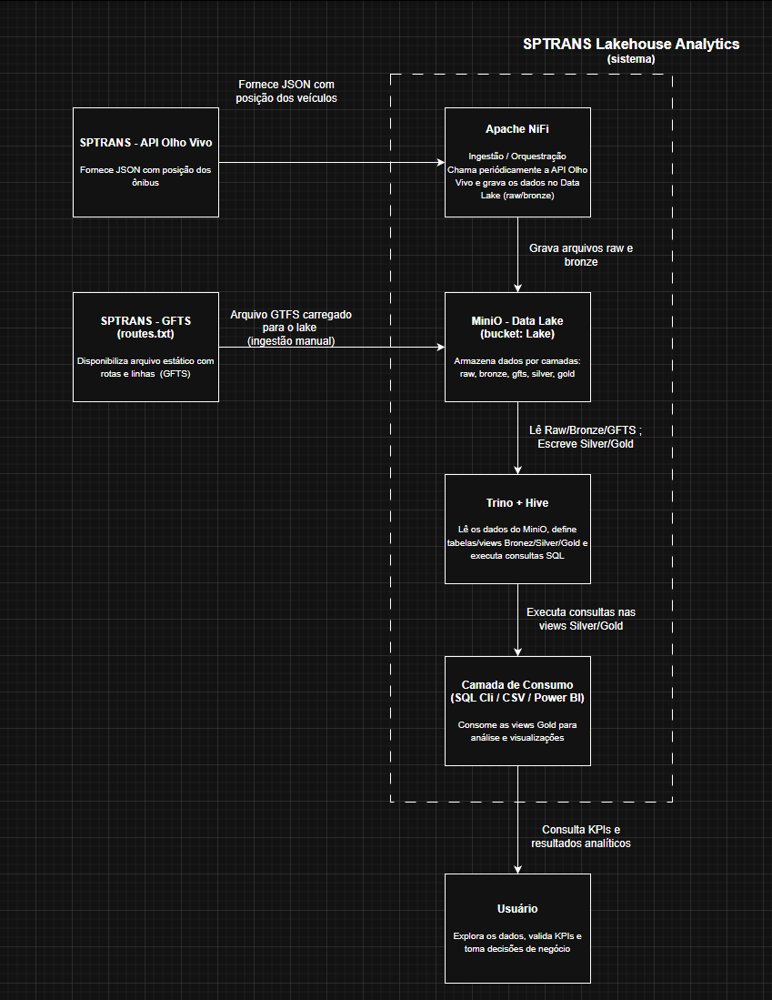
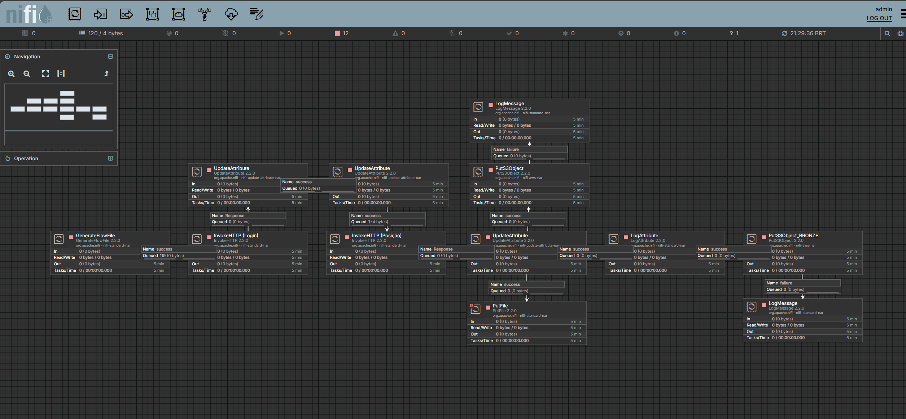
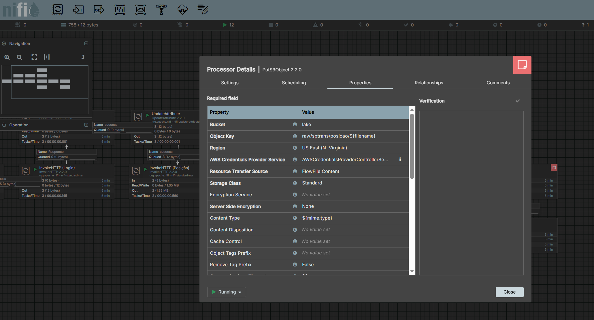
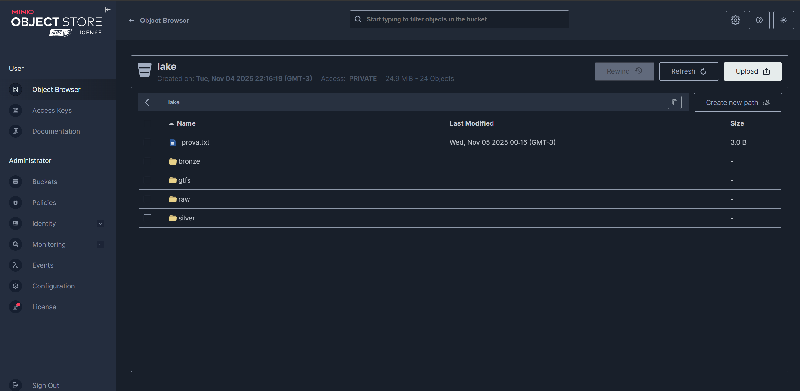
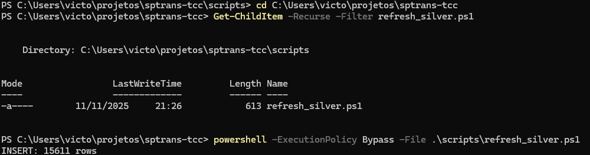
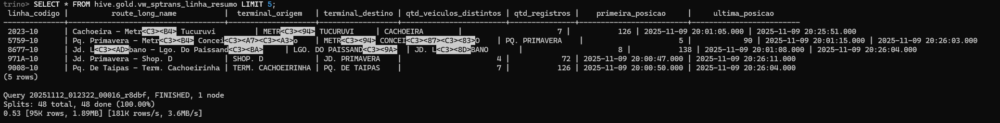
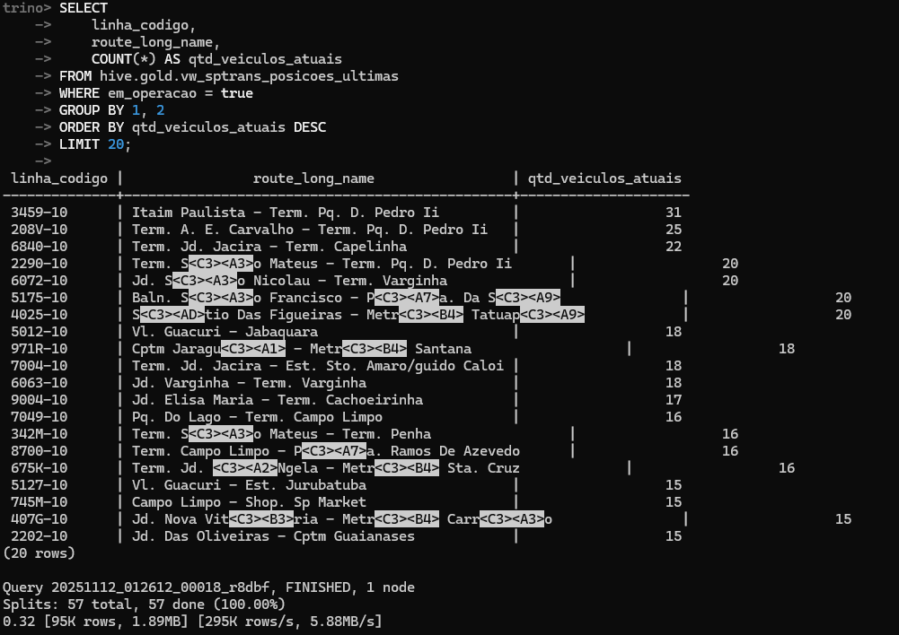
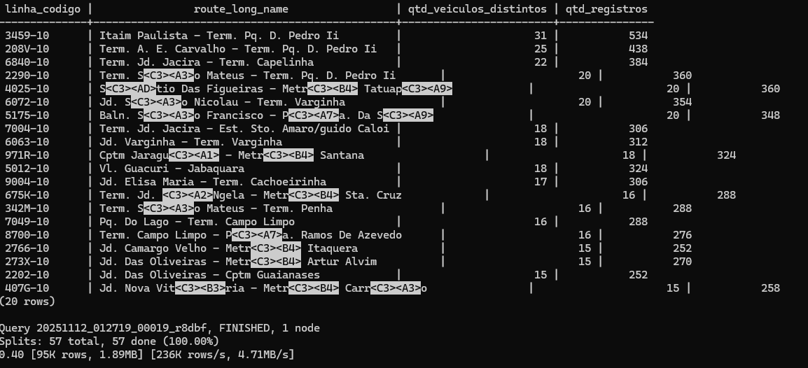
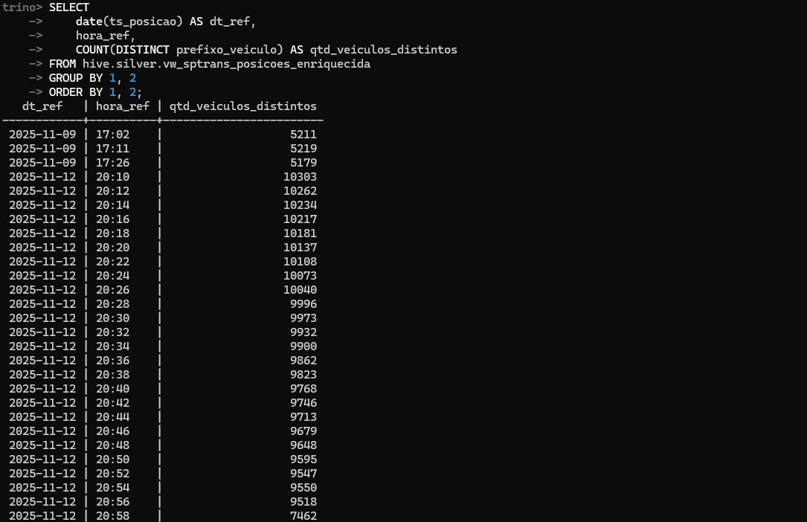

# Passo a Passo do Projeto – SPTrans Lakehouse Analytics

## 1. Objetivo Geral

O projeto visa construir um pipeline de dados quase em tempo real para monitorar a frota de ônibus da cidade de São Paulo, consumindo dados da API Olho Vivo (SPTrans) e integrando com informações estáticas do GTFS (General Transit Feed Specification).  
O ambiente foi desenvolvido com ferramentas open-source e tem como foco demonstrar o uso prático de conceitos de Engenharia de Dados, como ingestão, armazenamento em camadas (Raw → Bronze → Silver → Gold) e consultas analíticas.

---

## 2. Arquitetura da Solução

O pipeline foi estruturado em cinco componentes principais, conforme o diagrama de arquitetura (Figura 1):

1. SPTrans - API Olho Vivo** – fornece dados dinâmicos de posição dos ônibus em formato JSON.
2. Apache NiFi** – realiza a ingestão periódica dos dados e grava no MinIO.
3. MinIO (Data Lake)** – armazena os dados nas camadas *raw*, *bronze*, *silver*, *gold*.
4. Hive + Trino** – criam um catálogo de metadados e expõem as tabelas e views SQL.
5. Camada de Consumo** – consultas SQL e visualizações analíticas (CSV/BI).
 

*Figura 1 – Arquitetura geral do SPTrans Lakehouse Analytics.*  
(Arquivo: `docs/prints/Arquitetura_Projeto.png`)

Também pode-se observar a Arquitetura de todos os componentes do Projeto:
(Arquivo: `docs/Diagramas/Arquitetura_Componentes.png`)

---

## 3. Ingestão de Dados (Apache NiFi)

### 3.1 Fluxo de ingestão

O Apache NiFi foi utilizado para orquestrar a coleta dos dados da API Olho Vivo e gravá-los diretamente no MinIO.  
O fluxo principal é composto pelos seguintes processadores:

| `InvokeHTTP` - Chama periodicamente a API SPTrans. - Saída: JSON bruto |
| `UpdateAttribute` - Define metadados (timestamp, path, etc.). |
| `PutS3Object (Raw)` - Grava a resposta bruta no bucket `lake/raw/sptrans/posicao/` - Saída: Arquivo bruto |
| `PutS3Object (Bronze)` - Grava JSON consolidado em `lake/bronze/sptrans_posicoes/` - Saída: Arquivo estruturado |

*Fluxo NiFi completo mostrando os processadores.*  
(Arquivo: `docs/prints/nifi_flow.png`)

*Exemplo da configuração do PutS3Object (raw) apontando para o bucket MinIO.*  
(Arquivo: `docs/prints/nifi_puts3_config.png`)

### 3.2 Estrutura no MinIO

Após a execução do NiFi, os dados ficam armazenados no bucket `lake`, com a seguinte estrutura:

Lake/
- raw/sptrans/posicao/
- bronze/sptrans_posicoes/
- gtfs/routes/
- silver/
- gold/

Cada pasta representa uma camada lógica de maturidade dos dados:

- Camada: Raw
  Origem: Saída bruta da API Olho Vivo.
  Finalidade: Registro fiel do JSON original para auditoria e reprocessamento.
- Camada: Bronze
  Origem: Saída tratada pelo NiFi.
  Finalidade: Dados consolidados e organizados, ainda em formato semi-estruturado.
- Camada: GTFS
  Origem: Upload manual dos arquivos `routes.txt` (e futuros `stops`, `trips`, etc.).  
  Finalidade: Metadados estáticos sobre as linhas e rotas.
- Camada: Silver  
  Origem: Derivada de consultas SQL (flatten + enriquecimento). 
  Finalidade: Dados limpos e normalizados, prontos para análise.
- Camada: Gold 
  Origem: Views SQL analíticas. 
  Finalidade: Indicadores e KPIs consolidados. |

Visualização do bucket lake no painel do MinIO com as pastas Raw, Bronze, GTFS, Silver e Gold.
(Arquivo: `docs/prints/minio_bucket.png`)

---

## 4. Preparação das Camadas Silver e Gold

### 4.1 Criação da camada Silver (tratamento e normalização)

A camada Silver tem como objetivo transformar os dados da Bronze em um formato tabular adequado para análise, extraindo cada veículo, linha, posição geográfica e horário de referência.

O processo foi estruturado em dois elementos principais:

1. View lógica (`vw_sptrans_posicoes_flat`)  
   Responsável por aplicar o *flatten* do JSON da Bronze, convertendo a estrutura aninhada em linhas e colunas.

2. Tabela física (`sptrans_posicoes_flat`)
   Responsável por armazenar, de forma materializada, os dados já tratados, facilitando consultas recorrentes.

A carga da tabela física é executada por meio do script:

- `scripts/refresh_silver.ps1` – que chama o Trino via Docker e insere na tabela Silver os dados retornados pela view lógica.

Esse processo simula a automação de um job recorrente (por exemplo, via agendador do sistema operacional ou ferramenta de orquestração), garantindo que a camada Silver seja atualizada a partir dos dados coletados pelo NiFi.

*Execução do script `refresh_silver.ps1` com inserção de registros na tabela Silver.*  
(Arquivo: `docs/prints/powershell_refresh_silver.png`)

Arquivos relacionados:
- `sql/create_views_silver.sql` – definição da view Silver lógica.
- `scripts/refresh_silver.ps1` – materialização da Silver física.

### 4.2 Integração com GTFS (enriquecimento da Silver)

Para enriquecer as informações operacionais da API Olho Vivo com metadados de linhas e rotas, foi utilizada a base GTFS disponibilizada pela SPTrans.

Etapas principais:

1. Download do pacote GTFS e envio do arquivo `routes.txt` para `lake/gtfs/routes/`.
2. Criação da tabela externa `hive.silver_gtfs.routes` a partir do arquivo `routes.txt`.
3. Criação da view `hive.silver.vw_sptrans_posicoes_enriquecida`, que realiza o join entre:
   - a tabela física `hive.silver.sptrans_posicoes_flat` (posições dos veículos)
   - e a tabela `hive.silver_gtfs.routes` (metadados das linhas).

Essa view passa a expor, além das informações operacionais, o nome da linha, descrição da rota e demais atributos relevantes para análise.

Arquivos relacionados:
- `sql/create_views_silver.sql` – criação da tabela GTFS e da view enriquecida.
- `docs/prints/trino_silver_enriquecida.png` – exemplo da view enriquecida em consulta.

---

## 5. Camada Gold (Visões Analíticas)

A camada Gold consolida as principais regras de negócio sobre os dados já enriquecidos, expondo visões analíticas que podem ser consumidas diretamente por usuários, relatórios ou ferramentas de BI.

Duas views principais foram definidas:

1. `hive.gold.vw_sptrans_posicoes_ultimas` 
   Retorna, para cada combinação de linha e veículo, apenas a última posição registrada na base, permitindo analisar o “estado mais recente” da frota na janela coletada.

2. `hive.gold.vw_sptrans_linha_resumo`  
   Gera um resumo por linha, incluindo:
   - quantidade de veículos distintos observados,
   - número total de registros,
   - primeira e última posição registradas.

Essas visões simplificam o consumo de informações e servem como base direta para construção de KPIs e dashboards.

Arquivos relacionados:
- `sql/create_views_gold.sql` – contém as definições das views da camada Gold.

- `docs/prints/trino_gold_resumo.png` – resultado da view `vw_sptrans_linha_resumo`.

## 6. Consultas Analíticas (Exemplos de KPIs)

Com as views da camada Gold (e a view Silver enriquecida), foram definidas consultas analíticas para ilustrar como o lakehouse suporta indicadores de operação da frota.

Os principais KPIs definidos foram:

1. KPI 1 – Frota atual por linha  
   Utiliza a view `vw_sptrans_posicoes_ultimas` para identificar, na última leitura disponível, quais linhas possuem maior quantidade de veículos em operação.

2. KPI 2 – Linhas com maior número de veículos distintos 
   Baseado na view `vw_sptrans_linha_resumo`, identifica as linhas que apresentaram maior diversidade de veículos ao longo do período analisado, refletindo o porte e a intensidade da operação.

3. KPI 3 – Evolução temporal de veículos distintos  
   Utiliza a view `vw_sptrans_posicoes_enriquecida` para analisar como a quantidade de veículos distintos varia por data e por horário de referência, permitindo observar padrões de demanda e oferta na amostra coletada.

Essas consultas demonstram, de forma prática, o valor da arquitetura proposta, conectando:

- dados brutos da API,  
- enriquecimento com GTFS,  
- organização em camadas,  
- e geração de métricas acionáveis.

Arquivos relacionados:
- `sql/queries_kpi.sql` – contém todas as consultas analíticas utilizadas para os KPIs.

- `docs/prints/trino_kpi_frota_por_linha.png` – KPI 1.

- `docs/prints/trino_kpi_top_linhas.png` – KPI 2.

- `docs/prints/trino_kpi_evolucao_temporal_veiculos.png` – KPI 3.

